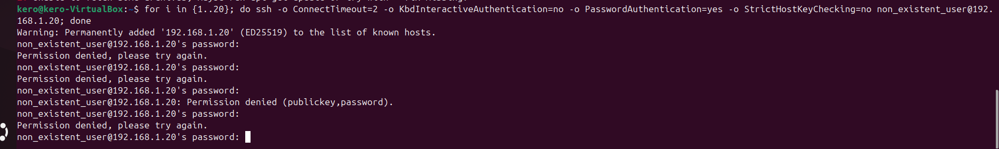
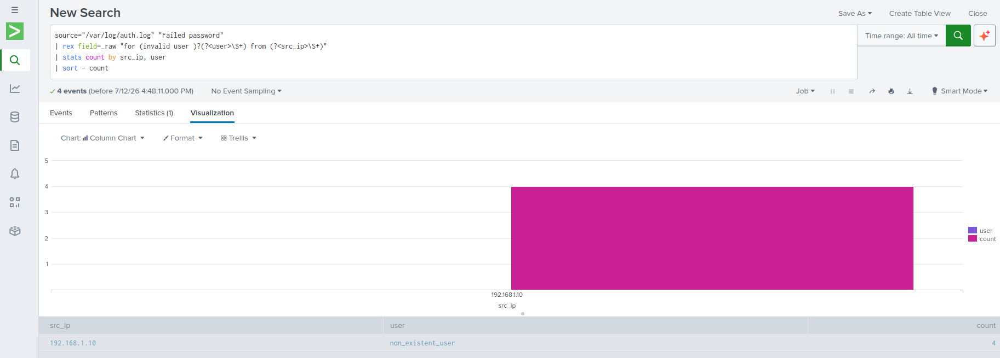

# SOC Analyst Lab: Brute Force Detection
This project simulates a real-world Security Operations Center (SOC) environment to detect and analyze brute-force attacks using Splunk.

## Project Overview
* **Environment:** Linux-based server with SSH logs.
* **Tooling:** Splunk Enterprise (Data Ingestion & SIEM).
* **Objective:** Detect unauthorized access attempts and set up automated alerts.

## Implementation Steps
1. **Data Ingestion:** Configured Splunk to monitor `/var/log/auth.log`.
2. **Attack Simulation:** Executed a scripted SSH brute-force attack to generate security events.
3. **Detection Engineering:** Developed custom SPL queries to identify and extract attacker IP addresses.
4. **Alerting:** Implemented a real-time alert for detecting >5 failed login attempts per minute.

## Screenshots

